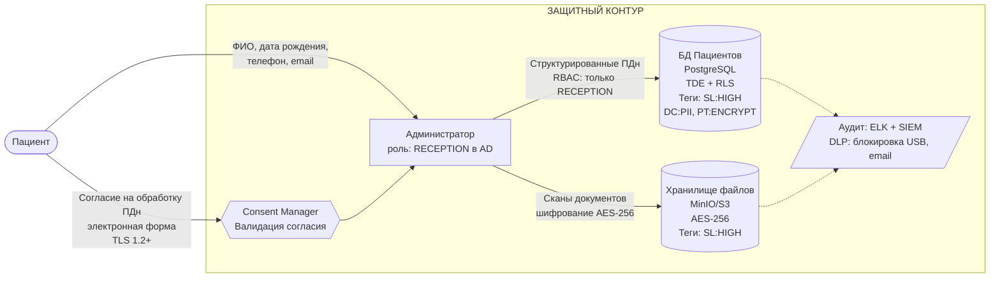
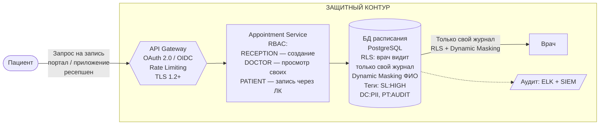
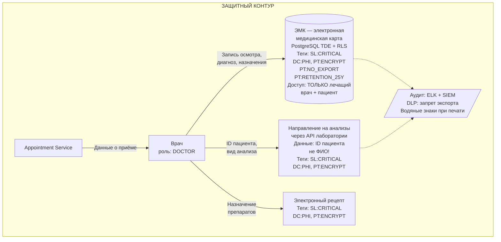
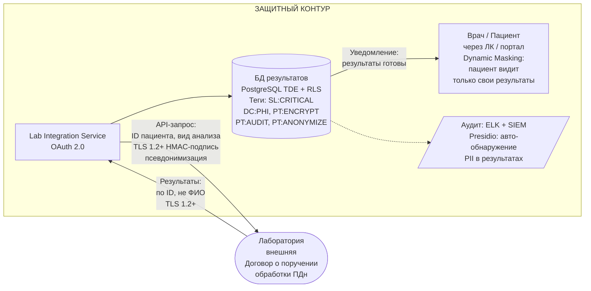
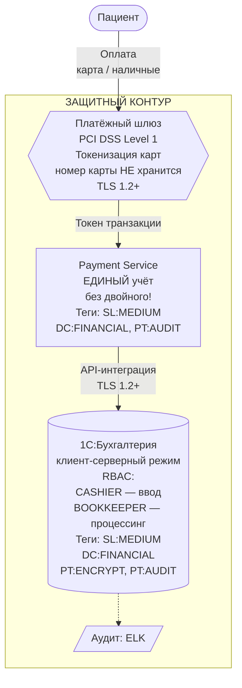
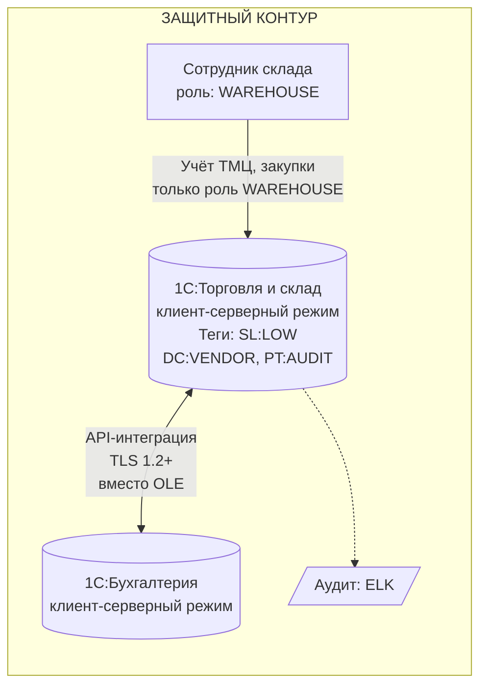
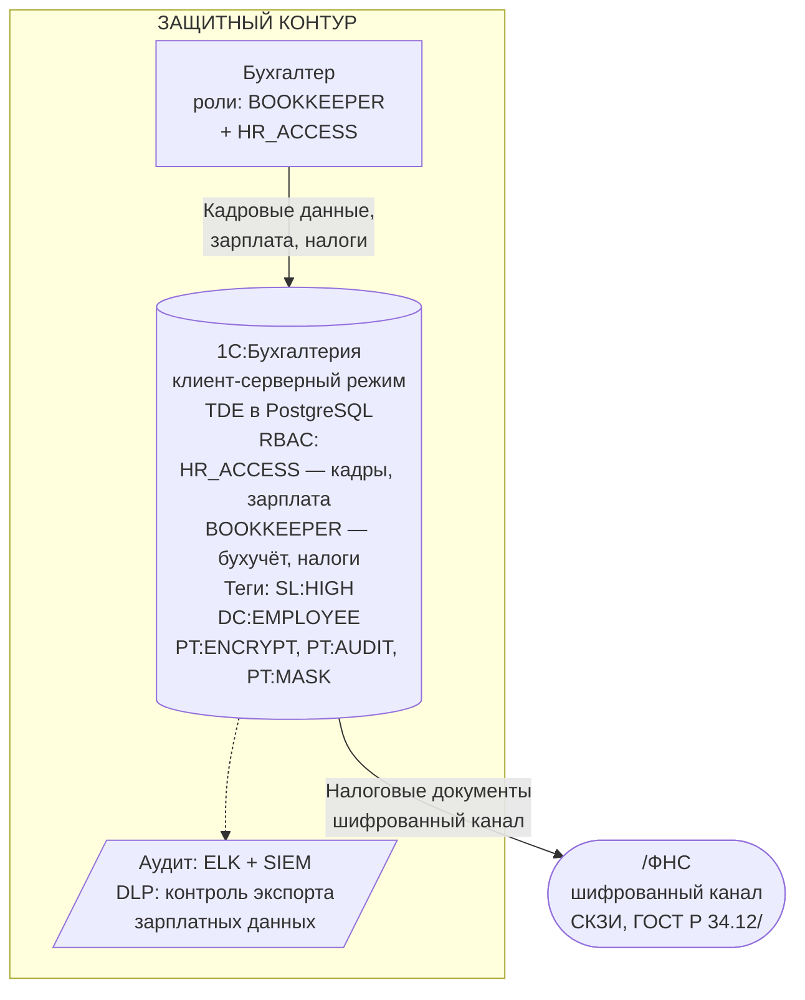
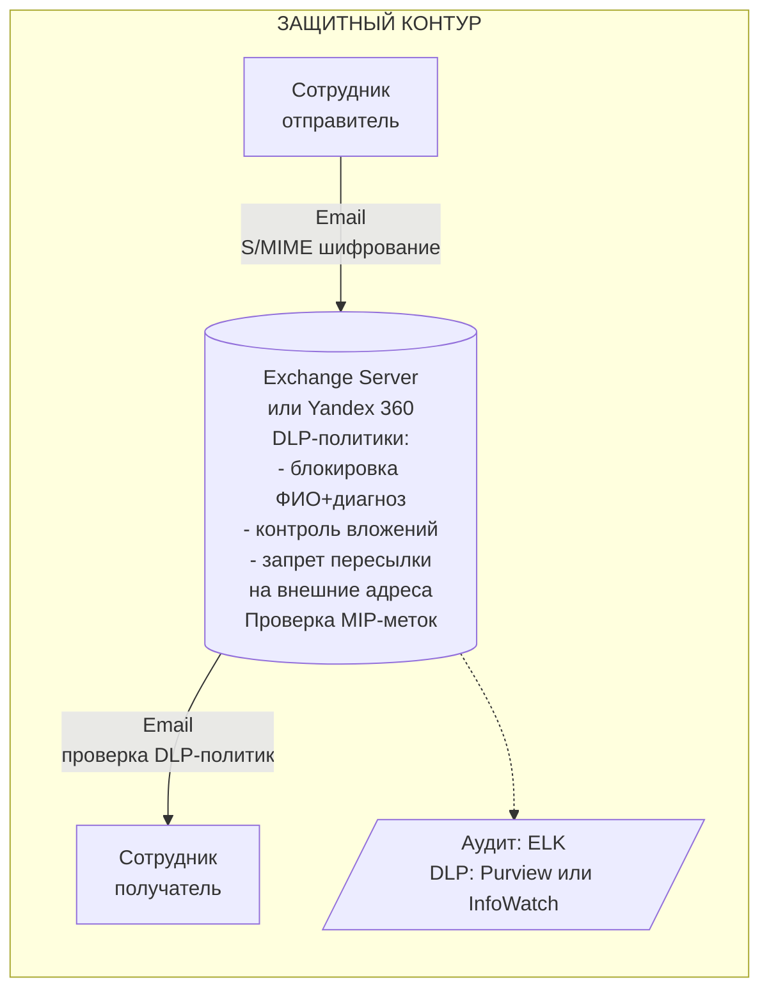

# Доработанные DFD-диаграммы (To-Be) с мерами защиты

Для каждого потока данных указаны конкретные инструменты и меры защиты на каждом этапе.

---

## DFD 1 (To-Be). Регистрация пациента

**Меры защиты на каждом этапе:**
1. **Ввод данных**: электронная форма согласия с ЭП, валидация через Consent Manager
2. **Передача данных**: TLS 1.2+ между рабочей станцией и сервером
3. **Хранение ПДн**: PostgreSQL с TDE (Transparent Data Encryption) + Row-Level Security
4. **Хранение файлов**: MinIO/S3-совместимое хранилище с шифрованием AES-256
5. **Контроль доступа**: RBAC через AD (группа RECEPTION), ABAC в приложении
6. **Тегирование**: автоматическое присвоение тегов `SL:HIGH`, `DC:PII`, `PT:ENCRYPT`
7. **Аудит**: все действия логируются в ELK, аномалии — в SIEM
8. **DLP**: блокировка копирования на USB, контроль email

---

## DFD 2 (To-Be). Запись пациента к специалисту

**Меры защиты:**
1. **API Gateway**: OAuth 2.0 + OIDC для аутентификации (портал/приложение), TLS 1.2+
2. **RBAC**: ресепшен создаёт записи, врач видит только свой журнал, пациент — только свои записи
3. **Row-Level Security**: на уровне БД врач не может запросить чужой журнал
4. **Dynamic Data Masking**: ФИО пациента маскируется для ролей, не являющихся лечащим врачом
5. **Аудит**: каждое действие с расписанием логируется

---

## DFD 3 (To-Be). Приём пациента (медицинский осмотр)

**Меры защиты:**
1. **ЭМК**: замена разрозненных файлов на структурированное хранение в PostgreSQL
2. **TDE**: шифрование на уровне БД
3. **RLS**: только лечащий врач и сам пациент имеют доступ к ЭМК
4. **Теги `SL:CRITICAL` + `DC:PHI`**: максимальный уровень защиты
5. **`PT:NO_EXPORT`**: запрет выгрузки медицинских данных за пределы системы
6. **Направления**: передача в лабораторию по ID пациента (не ФИО) через API
7. **Водяные знаки**: при печати документов — ФИО врача, дата, время
8. **Ретенция `PT:RETENTION_25Y`**: медицинские карты хранятся 25 лет

---

## DFD 4 (To-Be). Лабораторные анализы

**Меры защиты:**
1. **API-интеграция**: замена ручного обмена на API с OAuth 2.0 и HMAC-подписью
2. **TLS 1.2+**: шифрование канала передачи
3. **Псевдонимизация**: обмен по ID пациента, не по ФИО
4. **Договор о поручении обработки**: юридическое обоснование передачи данных в лабораторию
5. **RLS**: пациент видит только свои результаты, врач — только своих пациентов
6. **`PT:ANONYMIZE`**: при использовании данных для BI/ML — обезличивание
7. **Presidio**: автоматическое обнаружение PII в текстовых результатах анализов

---

## DFD 5 (To-Be). Оплата медицинских услуг

**Меры защиты:**
1. **Платёжный шлюз** (PCI DSS): данные карт не хранятся, только токенизированные ссылки
2. **Ликвидация двойного учёта**: единый сервис платежей, интеграция с 1С через API
3. **1С в клиент-серверном режиме**: вместо файлового — гранулярный контроль доступа
4. **RBAC**: кассир только вводит, бухгалтер — процессинг, разделение обязанностей
5. **TLS 1.2+**: все финансовые транзакции по шифрованному каналу

---

## DFD 6 (To-Be). Учёт ТМЦ

**Меры защиты:**
1. **Миграция 1С на клиент-серверный режим**: контроль доступа на уровне СУБД
2. **Замена OLE на API**: безопасное взаимодействие между 1С-системами через TLS
3. **RBAC**: роль WAREHOUSE — только учёт ТМЦ, нет доступа к бухгалтерии

---

## DFD 7 (To-Be). Кадровый учёт и зарплата

**Меры защиты:**
1. **Разделение ролей**: HR_ACCESS для кадров, BOOKKEEPER для бухучёта
2. **TDE**: шифрование данных сотрудников в БД
3. **Dynamic Masking**: размер зарплаты маскируется для всех, кроме ответственного бухгалтера
4. **СКЗИ**: передача налоговой отчётности по сертифицированному каналу (ГОСТ)
5. **DLP**: контроль экспорта зарплатных ведомостей

---

## DFD 8 (To-Be). Внутренняя коммуникация

**Меры защиты:**
1. **S/MIME**: шифрование писем с конфиденциальными данными
2. **DLP-политики**: блокировка отправки ПДн (ФИО + диагноз) в теле/вложениях
3. **Контроль вложений**: проверка MIP-меток — файлы с тегом `SL:CRITICAL` не пересылаются на внешние адреса
4. **Запрет пересылки**: письма с медицинскими данными не могут быть перенаправлены за пределы домена

---
