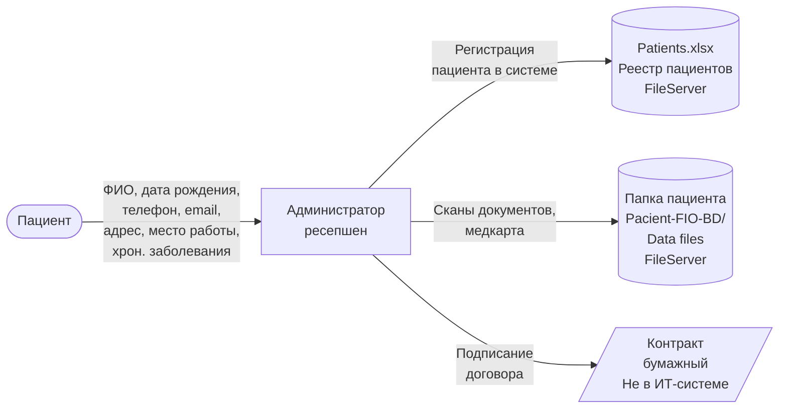
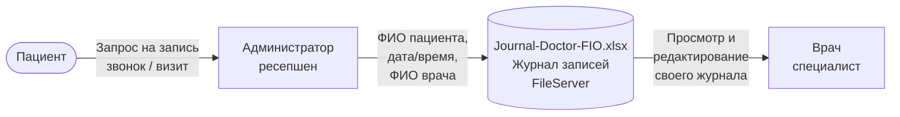
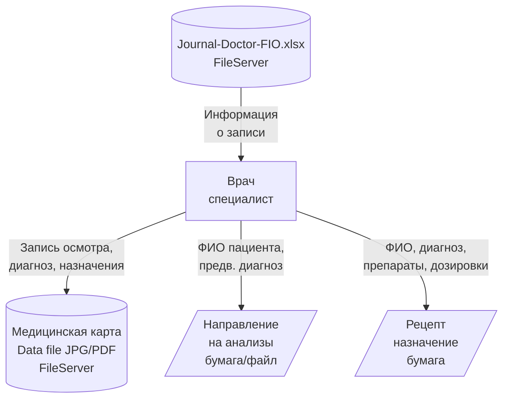
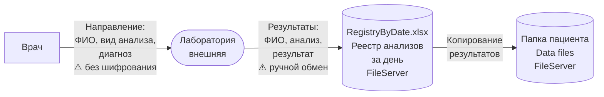
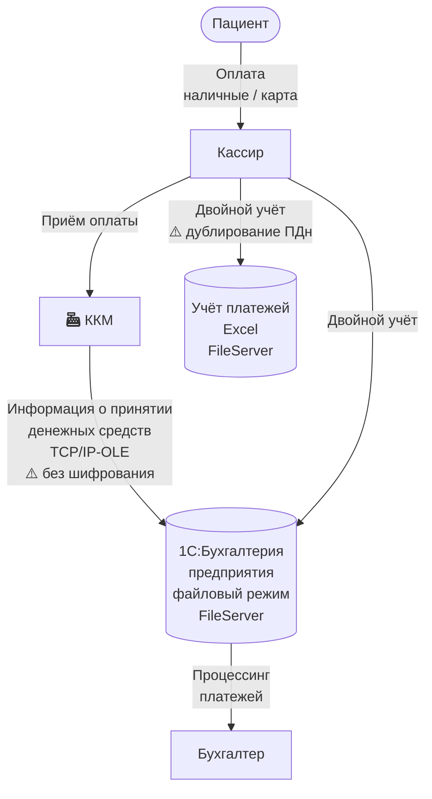
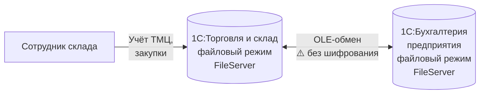
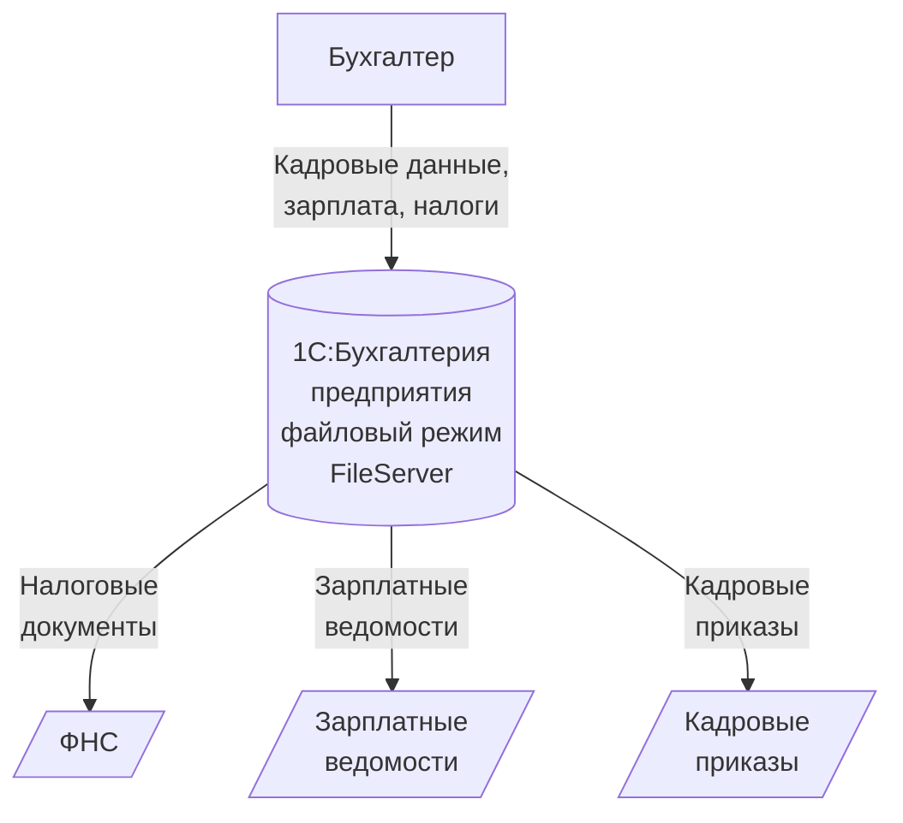
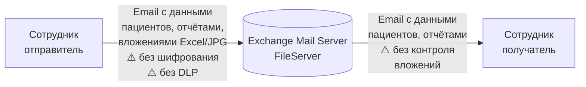

# Диаграммы потоков данных (DFD) — As-Is

---

## DFD 1. Регистрация пациента

**Данные в потоке:**
- ПДн: ФИО, дата рождения, телефон, email
- Расширенные ПДн: адрес прописки, место работы/учёбы, хронические заболевания
- Сканы документов: паспорт, полис (JPG/PDF)
- Согласие на обработку ПДн (бумага)

**Проблемы потока:**
- Данные передаются в открытом виде
- Нет шифрования при записи в Excel
- Имя папки пациента содержит ПДн (ФИО)
- Согласие на обработку ПДн не привязано к ИТ-системе

---

## DFD 2. Запись пациента к специалисту

**Данные в потоке:**
- ФИО пациента
- Дата и время приёма
- ФИО врача, специализация
- Контактный телефон пациента (для напоминания)

**Проблемы потока:**
- Все администраторы имеют доступ ко всем журналам всех врачей
- Врач имеет доступ к чужим журналам (нет ограничений на уровне файловой системы)
- Нет версионирования: изменения в Excel не отслеживаются
- Отдельный файл на каждого врача — при увеличении числа специалистов масштабирование невозможно

---

## DFD 3. Приём пациента (медицинский осмотр)

**Данные в потоке:**
- Медицинская карта: анамнез, диагнозы, осмотры, назначения (специальная категория ПДн)
- Направления на анализы: ФИО пациента, предварительный диагноз
- Рецепты: ФИО, диагноз, препараты, дозировки

**Проблемы потока:**
- Медицинские данные хранятся в открытом виде (JPG/PDF/Excel)
- Любой пользователь домена может получить доступ к файлам
- Нет разграничения: врач видит данные всех пациентов, не только своих
- Направления и рецепты не оцифрованы — невозможен аудит

---

## DFD 4. Лабораторные анализы

**Данные в потоке:**
- ФИО пациента
- Вид анализа, дата забора
- Результаты анализов (специальная категория ПДн)
- Предварительный/подтверждённый диагноз

**Проблемы потока:**
- Данные передаются в/из внешней лаборатории без шифрования
- Нет API-интеграции — ручной обмен (бумага/файлы)
- Реестр анализов RegistryByDate содержит данные всех пациентов за день — нарушение принципа минимизации
- Связь пациент — анализ осуществляется через ФИО, а не уникальный ID
- Нет контроля доступа к результатам: все сотрудники могут просматривать все файлы

---

## DFD 5. Оплата медицинских услуг

**Данные в потоке:**
- Сумма оплаты, дата, вид услуги
- ФИО пациента (привязка к платежу)
- Данные банковской карты (транзитно через ККМ)
- Фискальные данные (чек)

**Проблемы потока:**
- **Двойной учёт**: кассир вносит данные и в Excel, и в 1С — расхождения, дублирование ПДн
- Данные банковских карт обрабатываются ККМ без подтверждения PCI DSS
- Excel-файл с платежами доступен всем пользователям домена
- Нет шифрования данных в 1С (файловый режим)
- Связь ККМ с 1С через OLE — устаревший протокол без шифрования

---

## DFD 6. Учёт ТМЦ и работа склада

**Данные в потоке:**
- Наименования и количество ТМЦ
- Стоимость закупок, данные поставщиков (ФИО контактных лиц, реквизиты)
- Данные для бухгалтерской проводки

**Проблемы потока:**
- OLE-обмен между 1С-системами — без шифрования
- Данные контрагентов (ПДн контактных лиц) не защищены
- Файловый режим 1С — данные хранятся в открытом виде

---

## DFD 7. Кадровый учёт и зарплата

**Данные в потоке:**
- ФИО сотрудников, паспортные данные, ИНН, СНИЛС
- Размер зарплаты, налоговые отчисления
- Трудовые договоры, приказы

**Проблемы потока:**
- ПДн сотрудников хранятся в 1С в файловом режиме (без шифрования)
- Нет ролевого разграничения — все бухгалтеры видят данные всех сотрудников
- Документы для ФНС могут содержать ПДн, передача не контролируется

---

## DFD 8. Внутренняя коммуникация (электронная почта)

**Данные в потоке:**
- Любые данные, включая ПДн пациентов, медицинские данные, финансовую информацию
- Вложения: Excel-файлы, сканы документов

**Проблемы потока:**
- Нет DLP-политик: конфиденциальные данные свободно пересылаются по email
- Нет шифрования писем
- Нет контроля вложений
- Почтовый сервер на том же физическом сервере, что и файловое хранилище
